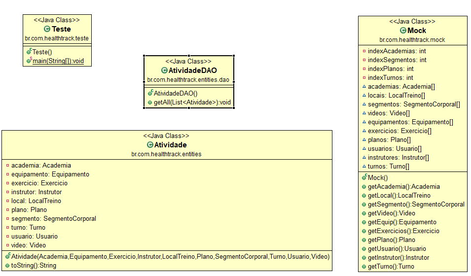
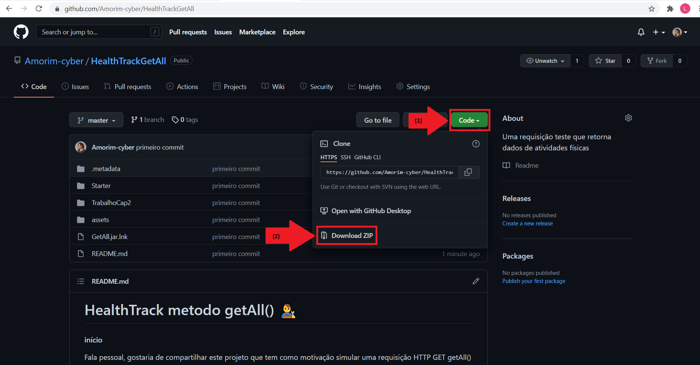
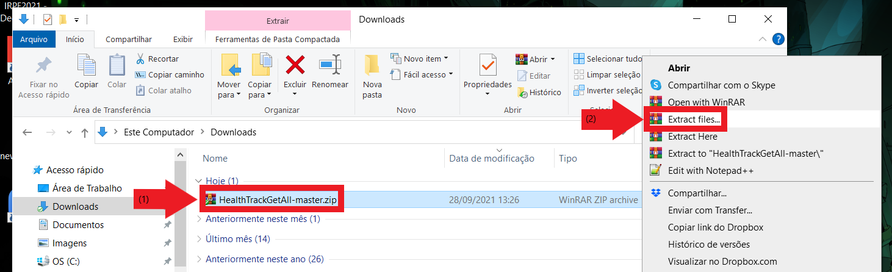
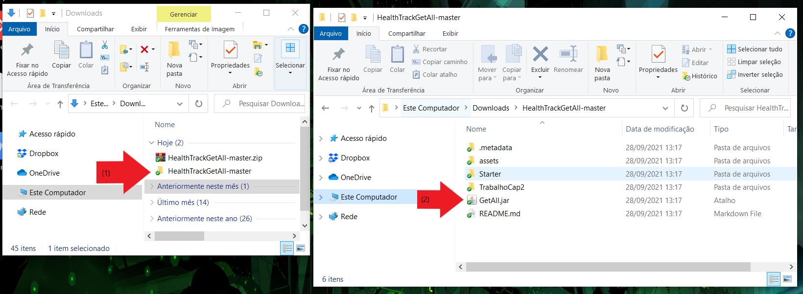

# HealthTrack metodo getAll() :man_mechanic:

#### início

Fala pessoal, gostaria de compartilhar este projeto que tem como motivação simular uma requisição HTTP GET getAll() do HealthTrack utilizando a linguagem java.

#### tech utilizada

* java

#### índice

O README foi dividido nos seguintes tópicos:

* O que é o HealthTrack ?
* Sobre a requisição getAll()
* Como abrir o programa
* Navegação
* Considerações Finais

#### O que é o HealthTrack ?

O Health Track é uma aplicação que registra e monitora a pesagem dos usuários. Primeiramente o usuário precisa fazer um cadastro para entrar no sistema. Após efetuar o login ele pode visualizar seus dados de cadastro; registrar, visualizar e editar sua lista de pesos; e consultar um dashboard dos dados  junto com o cálculo do último IMC.

Elaborei um protótipo utilizando HTML e CSS para ilustrar como seria o Health Track em ação.

</img>

Segue o <a href="https://github.com/Amorim-cyber/HealthTrack">Repositório</a> para maiores informações.

#### Sobre a requisição getAll()

Afim de ampliar o escopo do Healthtrack, estou testando novas inclusões. A ideia é incluir um registro de atividades físicas com diversas informações (o tipo de exercício, o equipamento utilizado, o instrutor que deu a aula). Criei o método teste getAll() para visualizar estas informações.

A disposição das principais classes ficou da seguinte forma:

</img>

* A classe <b>Teste</b> inicia a aplicação, a classe <b>Atividade</b> engloba todas as informações, a classe <b>AtividadeDAO</b> liga a classe teste com a classe Atividade e a classe <b>Mock</b> contem dados fictícios que serão visualizados no momento que o método getAll() é acionado.

#### Como abrir o programa

Siga os seguintes passos:

1. Baixe o arquivo neste repositório

</img>

2. Extraia o arquivo e salve em um diretório de sua escolha 

</img>

3. Clique no arquivo descompactado (nesse exemplo coloquei na pasta downloads) e em seguida clique na aplicação "GetAll"

</img>

##### PRONTO

A aplicação está pronta para uso.

</img>

### Navegação

Segue guia de uso do sistema 

* INÍCIO

  Tela de início, o usuário tem a opção de visualizar ou não todas as atividades

  </img>

* RESULTADO

  Caso o usuário aceita visualizar as atividades o programa irá imprimir os dados das atividades

  </img>

### Considerações finais

Siga todos os passos desse README que o sistema irá funcionar corretamente

A aplicação irá printar 5 atividades com dados imputados de forma aleatória

O intuito do projeto foi replicar um chamado que futuramente poderá ser aplicado de uma forma mais avançada conforme a evolução do projeto. Por hora ele nos ajuda a entender melhor como os dados irão se encaixar

### FORTE ABRAÇO ! :smile:

